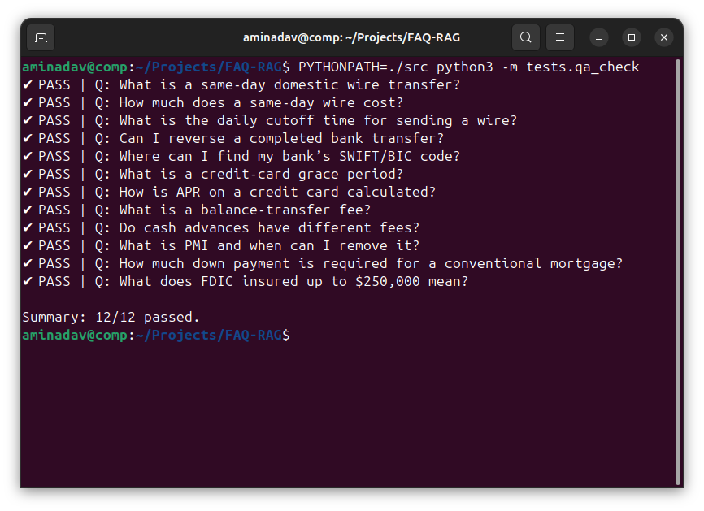
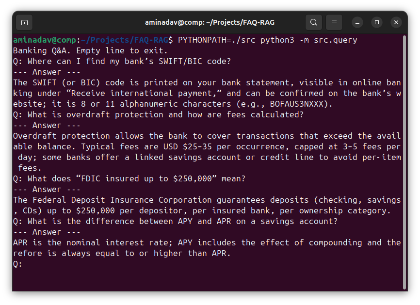

# FAQ‑RAG ― Banking Q&A Chatbot

**Portfolio Highlight – AI / NLP / Retrieval‑Augmented Generation**

This project demonstrates a full Retrieval‑Augmented Generation (RAG) pipeline that answers banking questions with deterministic, citation‑ready responses. It is designed to be minimal, transparent, and *test‑driven*, making it a solid reference or foundation for production chatbots where factual accuracy matters more than stylistic reformulation.

> **Stack**  Python | Sentence‑Transformers | ChromaDB | Pure CLI (no framework overhead)

---

## ✨ Key Features

|                                  | What it does                                                          | Why it matters                                           |
| -------------------------------- | --------------------------------------------------------------------- | -------------------------------------------------------- |
| **Granular Q&A ingestion**       | Each *question + answer* pair is indexed as a single vector document. | Prevents multi‑answer leakage & keeps retrieval precise. |
| **Deterministic testing**        | `tests/qa_check.py` normalises answers and checks 12 key queries.     | Guarantees factual correctness without LLM randomness.   |
| **One‑command rebuild**          | `ingest.py` (≈3 sec) recreates the vector store from `data/raw/`.     | Easy to extend—just drop new *.txt* FAQ files.           |

---

## 🖼️ Live Demo (CLI)

Below are fresh screenshots from the current build.

| Batch test | Interactive chat |
| ---------- | ---------------- |
|  |  |

---

## 🚀 Quick Start

```bash
# 1. Clone & enter
$ git clone https://github.com/your‑handle/FAQ‑RAG.git
$ cd FAQ‑RAG

# 2. Install & build index
$ python3 -m venv venv && source venv/bin/activate
$ pip install -r requirements.txt
$ PYTHONPATH=./src python3 -m src.ingest       # → Indexed 25 Q&A pairs

# 3. Chat in terminal
$ PYTHONPATH=./src python3 -m src.query
Q: How much does a same‑day wire cost?
--- Answer ---
Fees vary; typical U.S. retail banks charge between $20–35 per outgoing domestic wire.
```

Run automated tests anytime:

```bash
$ PYTHONPATH=./src python3 -m tests.qa_check
Summary: 12/12 passed.
```

---

## 🏗️ Project Layout

```
.
├── data/raw/               # Plain‑text banking FAQ files (English)
├── src/                    # All Python modules
│   ├── ingest.py           # Build / update Chroma vector store
│   ├── query.py            # CLI chat (deterministic)
│   ├── embeddings.py       # Sentence‑Transformer wrapper
│   └── utils_text.py       # Normalisation helpers
├── tests/qa_check.py       # 12‑point regression test suite
└── requirements.txt        # chromadb, sentence‑transformers, langdetect …
```

---

## 📈 Extending the Knowledge Base

1. Create a file `data/raw/your_topic_faq.txt` with alternating **Question** then **Answer** paragraphs (blank line between them).
2. Run `PYTHONPATH=./src python3 -m src.ingest`.
3. Add an entry to `tests/qa_check.py` to keep regression coverage high.

---

## 🙋‍♂️ Author & Context

Created by **Aminadav** as part of my AI/NLP portfolio (prompt engineering & RAG pipelines). The screenshots and tests were run on Ubuntu 24 inside a virtual environment; no external APIs required.

Feel free to fork, star or open issues!

